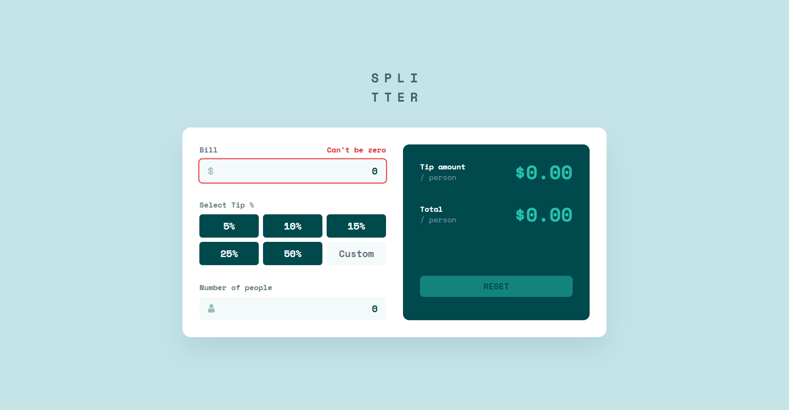

# Frontend Mentor - Tip calculator app solution

This is a solution to the [Tip calculator app challenge on Frontend Mentor](https://www.frontendmentor.io/challenges/tip-calculator-app-ugJNGbJUX). Frontend Mentor challenges help you improve your coding skills by building realistic projects.

## Table of contents

- [Overview](#overview)
  - [The challenge](#the-challenge)
  - [Screenshot](#screenshot)
  - [Links](#links)
- [Built with](#built-with)
- [Author](#author)
- [Acknowledgments](#acknowledgments)

## Overview

### The challenge

Users should be able to:

- View the optimal layout for the app depending on their device's screen size
- See hover states for all interactive elements on the page
- Calculate the correct tip and total cost of the bill per person

### Screenshot

### Links

- Solution URL: [https://github.com/benruwel/splitter](https://github.com/benruwel/splitter)
- Live Site URL: [https://splitter.benruwel.vercel.app/](https://splitter.benruwel.vercel.app/)

### Built with

- Semantic HTML5 markup
- CSS custom properties
- Mobile-first workflow
- [Angular](https://angular.io/) - JS Framework
- [TailwindCss](https://v2.tailwindcss.com/) - CSS Lib

## Author

- Website - [Ben Ruwel](https://benruwel.vercel.app/)
- Frontend Mentor - [@benruwel](https://www.frontendmentor.io/profile/benruwel)
